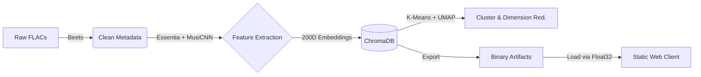

Sonic Galaxy Project: Technical Preview

### A Client-Side Architecture for Static, Vector-Based Music Discovery

> **Abstract:** This project explores a serverless architecture for high-dimensional music discovery. By applying "Compute Once, Deploy Everywhere" principles, we distill the semantic structure of a 4,000+ song library into a lightweight, static web client. This approach replaces heavy server-side vector databases (like ChromaDB) with efficient client-side binary operations, enabling real-time, neural network-based similarity matching without an active backend.

## 1. System Architecture

The core strategy relies on **pre-computation** and **binary serialization**. Instead of querying a live database, the application loads the entire vector space into the client's memory, treating the dataset as an immutable artifact rather than a dynamic service.

## 2. Feature Engineering & Embeddings

Unlike simple metadata filters (Genre/BPM), this system "listens" to the audio using the **Essentia** library and **MusiCNN** TensorFlow models.

* **Deep Learning Embeddings (200D):** We extract the output from the `model/dense/BiasAdd` layer of the pre-trained `msd-musicnn-1` model. This results in a 200-dimensional vector representing the semantic "texture" of the track.

* **Scalar Features:** Augmented with standard descriptors (Danceability, Spectral Centroid, Integrated Loudness) for fine-tuning.

## 3. The "Triangulation" Protocol (Client-Side)

The core innovation is the ability to perform complex vector math in the browser without an active backend API.

### 3.1 The Binary Strategy

To bypass JSON parsing overhead and reduce payload size, the 200D embeddings for 4,000+ songs are serialized into a raw binary file (`embeddings.bin`).

* **Loading:** The client fetches this as an `ArrayBuffer`.

* **Memory:** It is mapped directly to a `Float32Array` for practically zero-latency access.

### 3.2 Real-Time Vector Math

When a user selects 2+ "seed" tracks in the 3D visualizer, the browser executes the following logic in real-time:

1. **Centroid Calculation:**

$$
\vec{C} = \frac{1}{n} \sum_{i=1}^{n} \vec{v}_i
$$

2. **Cosine Similarity Search:**

The system iterates through the `Float32Array` using `.subarray()` to avoid memory allocation, performing the dot product and magnitude calculations against the entire library:

$$
\text{similarity} = \frac{\vec{C} \cdot \vec{T}}{\|\vec{C}\| \|\vec{T}\|}
$$

   
## 4. Semantic Clustering

Navigation is powered by unsupervised learning, providing structure to the galaxy.

* **Algorithm:** K-Means Clustering (Optimized at $k=12$ via Elbow Method).

* **Naming:** Cluster centroids are analyzed by **Gemini 2.0 Flash**, which generates evocative names (e.g., *"Fractured Fairytales"*, *"Iridescent Rebellion"*) based on the metadata of tracks within that sector.

## 5. Performance Data

| Metric | Server-Side / Active Backend | Static Client Architecture |
| :--- | :--- | :--- |
| **Index Size** | ~21 MB (ChromaDB + Indexes) | ~2.7 MB (Raw Binary) |
| **Compute** | Server CPU/GPU (API Calls) | Client CPU (Vector Math) |
| **Latency** | Network RTT + Processing | < 50ms (In-Memory) |
| **Host Cost** | $$$ (VPS/Container) | $0 (GitHub Pages) |

### Tech Stack

* **Audio Processing:** `Beets`, `Essentia`

* **ML & Data:** `MusiCNN`, `ChromaDB`, `Gemini API`

* **Frontend:** `Plotly.js`, `Vanilla JS`, `Float32Array`
